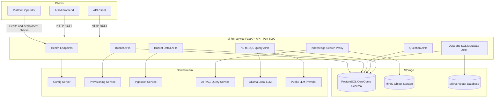

# User Manual and Deployment Guide: `PICC-AIKM-AIKM-backend`

Enterprise operations, architectural workflows, configuration management, and deployment instructions for **`PICC-AIKM-AIKM-backend`**.

---

## Table of Contents

1. [Architecture and System Overview](#1-architecture-and-system-overview)
2. [Runtime Prerequisites](#2-runtime-prerequisites)
3. [Configuration Reference](#3-configuration-reference)
4. [Deployment Strategies](#4-deployment-strategies)
   - [Local and Standalone Deployment](#local-and-standalone-deployment)
   - [Docker Compose Deployment](#docker-compose-deployment)
   - [Kubernetes Deployment](#kubernetes-deployment)
5. [Operational Health and Observability](#5-operational-health-and-observability)
6. [Troubleshooting and FAQs](#6-troubleshooting-and-faqs)

---

## 1. Architecture and System Overview

`PICC-AIKM-AIKM-backend` provides the `ai-km-service` FastAPI application for AI Knowledge Management metadata operations and knowledge-search asset proxying.



### Key Functional Responsibilities

1. **Knowledge Bucket Management**
   - Create, update, delete, and fetch bucket records.
   - Track account-to-bucket relationships.
   - Trigger optional bucket provisioning callbacks when enabled.

2. **Bucket Detail and Ingestion Management**
   - Manage document, Git, and Redmine bucket detail records.
   - Accept file uploads and metadata through multipart APIs where supported.
   - Trigger optional ingestion callbacks when enabled.

3. **Question, Database, SQL, DDL, and Rule Metadata**
   - Manage saved question details for selected buckets.
   - Manage database details, saved SQL details, DDL metadata, and rule metadata.
   - Support NL-to-SQL workflows through model, repository, and service layers.

4. **Knowledge Search and Asset Proxying**
   - Forward search requests to the configured AI RAG query service.
   - Rewrite returned image references through `/manageKnowledge/assets/image`.
   - Serve protected MinIO objects through the backend rather than exposing direct object-storage URLs.

5. **Health and Runtime Diagnostics**
   - Expose `/health` for lightweight liveness checks.
   - Expose `/health/deep` for database-backed readiness checks.
   - Attach `X-Request-ID` headers to non-health requests for log correlation.

---

## 2. Runtime Prerequisites

| Component | Minimum / Expected Version | Notes |
| :--- | :--- | :--- |
| **Python Runtime** | 3.13 recommended | Matches `Dockerfile.api`. |
| **FastAPI / Uvicorn** | From `requirements-api.txt` | Runs the HTTP API. |
| **PostgreSQL** | 16 recommended | Local Compose uses `postgres:16`. |
| **Docker Engine** | 20.10+ | Required for containerized local runs. |
| **Docker Compose** | v2 recommended | Used by `compose.yml`. |
| **Config Server** | Environment-specific | Required unless `CONFIG_SERVER_REQUIRED=false` and local overrides supply all required values. |
| **MinIO** | Environment-specific | Required for image asset proxying paths. |
| **Milvus** | Environment-specific | Required for vector collection operations. |
| **AI RAG Query Service** | Environment-specific | Required by `/manageKnowledge/search`. |
| **Ollama or Public LLM Provider** | Environment-specific | Required for configured NL-to-SQL or embedding flows. |

---

## 3. Configuration Reference

All runtime values should be supplied by the config server, environment variables, or a local `.env` file. Do not commit real credentials or environment-specific values.

Use this placeholder pattern for local configuration:

```env
# Config server bootstrap
CONFIG_SERVER_URL=<CONFIG_SERVER_URL>
CONFIG_APP_NAME=<CONFIG_APP_NAME>
CONFIG_PROFILE=<CONFIG_PROFILE>
CONFIG_TAG=<CONFIG_TAG>
CONFIG_SERVER_TIMEOUT=5
CONFIG_SERVER_REQUIRED=false
ALLOW_LOCAL_CONFIG_OVERRIDES=true

# API
API_HOST=0.0.0.0
API_PORT=8000
API_PUBLIC_URL=http://localhost:8000
LOG_LEVEL=INFO

# PostgreSQL
PG_HOST=<POSTGRES_HOST>
PG_PORT=5432
PG_DB=<POSTGRES_DATABASE>
PG_USER=<POSTGRES_USER>
PG_PASSWORD=<POSTGRES_PASSWORD>
PG_SCHEMA=<POSTGRES_SCHEMA>
PG_POOL_MIN=1
PG_POOL_MAX=10

# Identity
USER_HEADER=User
DEFAULT_USER=system

# Optional service integrations
PROVISION_ENABLED=false
PROVISION_SERVICE_URL=<PROVISION_SERVICE_URL>
PROVISION_DELETE_URL=<PROVISION_DELETE_URL>
INGESTION_ENABLED=false
INGESTION_SERVICE_URL=<INGESTION_SERVICE_URL>
INGESTION_DELETE_URL=<INGESTION_DELETE_URL>
CALLBACK_BASE_URL=http://localhost:8000
HTTP_TIMEOUT=30

# Runtime mode
MODEL_TYPE=local
OPENAI_API_KEY=<OPENAI_API_KEY>

# Vector, object storage, and RAG services
MILVUS_HOST=<MILVUS_HOST>
MILVUS_PORT=19530
MILVUS_DB_NAME=<MILVUS_DB_NAME>
MINIO_HOST=<MINIO_HOST>
MINIO_ROOT_USER=<MINIO_ROOT_USER>
MINIO_ROOT_PASSWORD=<MINIO_ROOT_PASSWORD>
MINIO_SECURE=false
MINIO_BUCKET=<MINIO_BUCKET>
RAG_QUERY_SERVICE_URL=<RAG_QUERY_SERVICE_URL>

# Local LLM and NL-to-SQL
OLLAMA_BASE_URL=<OLLAMA_BASE_URL>
OLLAMA_KEEP_ALIVE=<OLLAMA_KEEP_ALIVE>
OLLAMA_NUM_CTX=16384
PG_CONNECTION_STRING_VANNA=<PG_CONNECTION_STRING_VANNA>
VANNA_N_RESULTS=6
LLM_MODEL=<LLM_MODEL>
LLM_TEMPERATURE=0
LLM_MAX_TOKENS=1000
SQL_MILVUS_COLLECTION=<SQL_MILVUS_COLLECTION>
```

Important rules:

- Set `CONFIG_SERVER_REQUIRED=true` in environments where the service must not start without centralized configuration.
- Use `ALLOW_LOCAL_CONFIG_OVERRIDES=true` only for local development or controlled testing.
- Use `MODEL_TYPE=local` when local development should not require public LLM credentials.
- Set `PROVISION_ENABLED=false` and `INGESTION_ENABLED=false` unless the downstream services are reachable and configured.
- Treat `PG_PASSWORD`, `OPENAI_API_KEY`, `ANTHROPIC_API_KEY`, `MINIO_ROOT_PASSWORD`, and `PG_CONNECTION_STRING_VANNA` as sensitive.

---

## 4. Deployment Strategies

### Local and Standalone Deployment

1. Create and activate a virtual environment:

   ```bash
   python -m venv .venv
   .venv\Scripts\activate
   python -m pip install --upgrade pip
   pip install -r requirements-api.txt
   ```

2. Copy the environment template:

   ```bash
   copy .env.sample .env
   ```

3. Fill placeholders in `.env` with local development values.

4. If using an existing PostgreSQL database, apply the schema through the approved schema process. For disposable local development only, the checked-in schema can be applied manually:

   ```bash
   psql "<POSTGRES_CONNECTION_STRING>" -v ON_ERROR_STOP=1 -f db/schema.sql
   ```

5. Start the API:

   ```bash
   python run_api.py
   ```

6. Verify the service:

   ```bash
   curl http://localhost:8000/health
   curl http://localhost:8000/health/deep
   ```

### Docker Compose Deployment

Docker Compose starts PostgreSQL and the API from this repository.

```bash
docker compose up --build
```

The local API is available at:

```text
http://localhost:8000
```

On first database-volume creation, `compose.yml` mounts `db/schema.sql` into the PostgreSQL container initialization directory.

Useful commands:

```bash
docker compose ps
docker compose logs -f api
docker compose down
```

To rebuild the local database from the checked-in schema:

```bash
docker compose down -v
docker compose up --build
```

For governed shared environments, follow the approved schema-deployment process instead of relying on local Compose database initialization.

### Kubernetes Deployment

Kubernetes manifests are stored under `k8s-manifest/`:

```text
k8s-manifest/
├── configmap.yaml
├── deployment-api.yaml
└── service-api.yaml
```

Before deploying, replace all environment-specific values in `configmap.yaml` with approved values or placeholders managed by the target environment. Do not commit real internal URLs, credentials, or private endpoints.

Apply manifests:

```bash
kubectl apply -f k8s-manifest/configmap.yaml -n <NAMESPACE>
kubectl apply -f k8s-manifest/deployment-api.yaml -n <NAMESPACE>
kubectl apply -f k8s-manifest/service-api.yaml -n <NAMESPACE>
```

Check rollout status:

```bash
kubectl rollout status deployment/<DEPLOYMENT_NAME> -n <NAMESPACE>
kubectl get pods -n <NAMESPACE> -l app=<APP_LABEL>
```

Port-forward for validation:

```bash
kubectl port-forward service/<SERVICE_NAME> 8000:8000 -n <NAMESPACE>
curl http://localhost:8000/health
curl http://localhost:8000/health/deep
```

Deployment notes:

- The container listens on port `8000`.
- Liveness and readiness probes should call `/health` unless the environment wants database readiness to gate traffic with `/health/deep`.
- Runtime application config is injected through the ConfigMap in the current manifest pattern.
- Store secrets in an approved secret-management mechanism rather than ConfigMaps.
- Keep image tags immutable for release deployments. Avoid relying on `latest` in production.

---

## 5. Operational Health and Observability

| Endpoint | Purpose | Expected Result |
| :--- | :--- | :--- |
| `GET /` | Basic service status | Service name, version, running status |
| `GET /health` | Lightweight liveness check | `{"status":"healthy","service":"up"}` |
| `GET /health/deep` | Database readiness check | Healthy response when PostgreSQL is reachable |
| `GET /docs` | Swagger UI | Interactive API documentation |
| `GET /openapi.json` | OpenAPI schema | Machine-readable API schema |

Operational checks:

- Confirm the API process starts without missing required configuration errors.
- Confirm `/health` passes before exposing the service.
- Confirm `/health/deep` passes before routing production traffic that depends on database reads/writes.
- Use the `X-Request-ID` response header to correlate client errors with server logs.
- Review startup logs for config-server, PostgreSQL pool, and downstream integration failures.

Primary API groups:

```text
/manageBucket
/manageBucketDetails
/manageQuestions
/manageDataSql
/manageSqlQuery
/manageKnowledge
```

---

## 6. Troubleshooting and FAQs

### Q: The service fails at startup with missing configuration values.

**A**: `src/config/settings.py` validates required effective configuration before startup completes. Ensure the config server returns all required keys, or set `CONFIG_SERVER_REQUIRED=false` and provide complete local overrides in `.env` for local development.

### Q: The service cannot reach the config server.

**A**: Check `CONFIG_SERVER_URL`, `CONFIG_APP_NAME`, `CONFIG_PROFILE`, `CONFIG_TAG`, and `CONFIG_SERVER_TIMEOUT`. For local-only development, set `CONFIG_SERVER_REQUIRED=false` and `ALLOW_LOCAL_CONFIG_OVERRIDES=true`, then provide all required runtime settings locally.

### Q: `/health` passes but `/health/deep` fails.

**A**: The API process is alive, but PostgreSQL readiness failed. Check `PG_HOST`, `PG_PORT`, `PG_DB`, `PG_USER`, `PG_PASSWORD`, `PG_SCHEMA`, network access, and whether the schema has been applied.

### Q: Docker Compose starts but the database tables are missing.

**A**: PostgreSQL only runs initialization scripts when the database volume is first created. Recreate the local volume with `docker compose down -v` and start again, or apply the schema manually for disposable local development.

### Q: Knowledge search returns image URLs that the browser cannot load.

**A**: Verify `API_PUBLIC_URL`, `RAG_QUERY_SERVICE_URL`, MinIO settings, and network reachability. The backend rewrites RAG image metadata to `/manageKnowledge/assets/image` so the frontend should load images through this service.

### Q: Provisioning or ingestion callbacks do not run.

**A**: Check `PROVISION_ENABLED`, `INGESTION_ENABLED`, the corresponding service URLs, delete URLs, and `CALLBACK_BASE_URL`. Keep these disabled for CRUD-only local development.

### Q: NL-to-SQL or embedding flows fail.

**A**: Check `MODEL_TYPE`, LLM model settings, Ollama settings, embedding settings, Vanna settings, and any required API keys for non-local modes. Use `MODEL_TYPE=local` when public provider credentials should not be required.

### Q: Kubernetes pods start with stale or unsafe configuration.

**A**: Review `k8s-manifest/configmap.yaml` and the deployment environment. Replace environment-specific values through the approved configuration process and keep secrets out of ConfigMaps.
